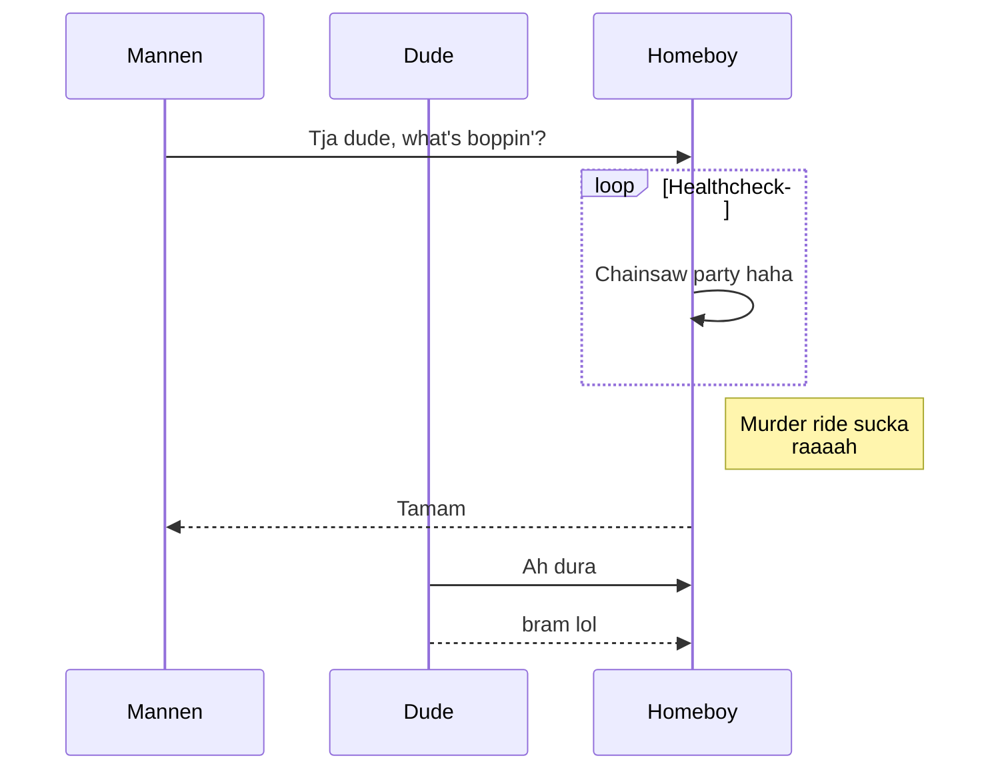

## Hello man,
# I've seen footage

Happy hour family night

```javascript
const gorillaMan = (a, b) => a * b;
```



## Userstory 007
To use Bold in markdown:
Add to asterisks between text
This is how you write:
"This is **This is gonna be bold**"
This is **Bold text**

## Userstory 008


** Hur man lägger in en emoticon i markdown **  

1. Hitta en emoticon du gillar i detta fall använder jag mig av sunglasses

2. Lägg kolon framför och efter emoticon så det blir såhär

:dinEmoticon:

:sunglasses: 
