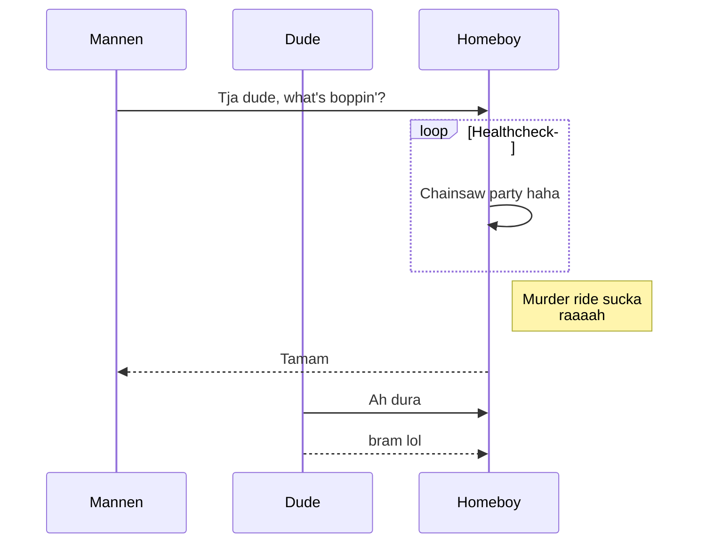

## Hello man,
# I've seen footage

Happy hour family night

```javascript
const gorillaMan = (a, b) => a * b;
```


#Making lists

There are a few ways of making lists.

##1.

```
:put =range(11,12))
```

in an old-school typewriter way, these numbers list vertically.

##2. You can also press ctrl+p to do a block selection, and through "veteran speed keyboarding" make lists incredibly fast.

##3. Of course you can still work the same good old <ul/><li/>-way

#Making codeblocks

Below is just a simple written function, with a nice "framing" to it.
It doesn't do much, but it looks great.

```js
function Kristofer () {
   return Kristofer;
}
```
