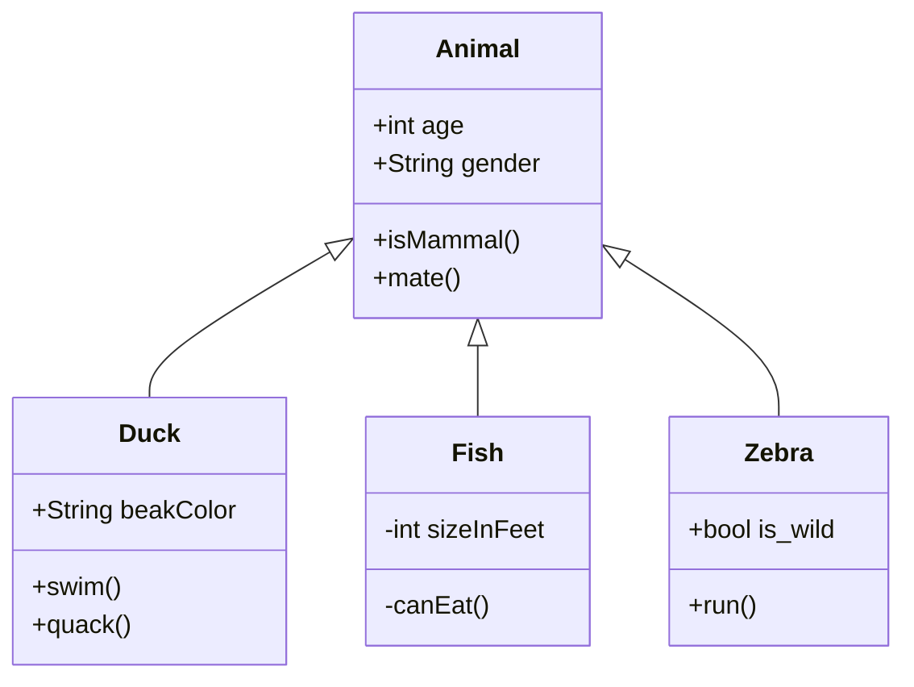
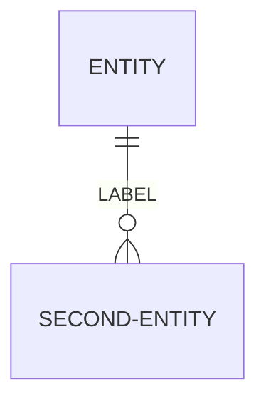
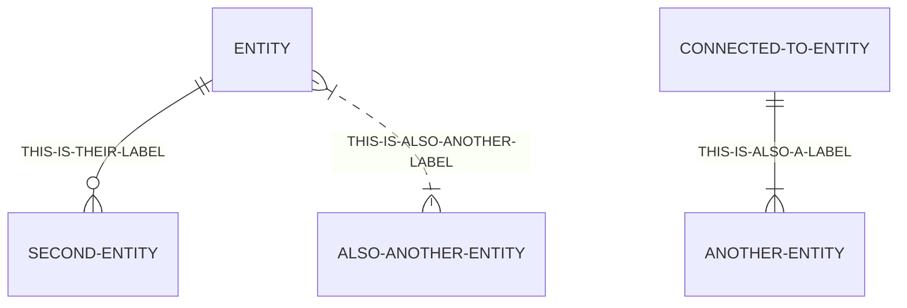
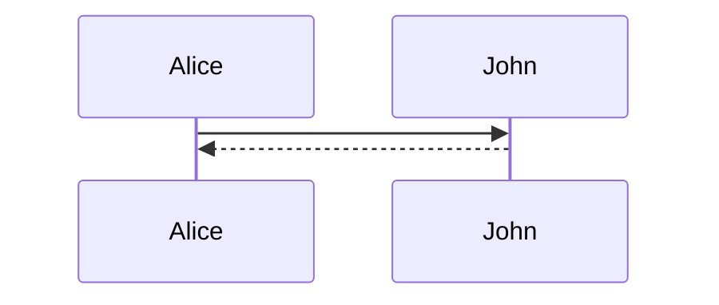
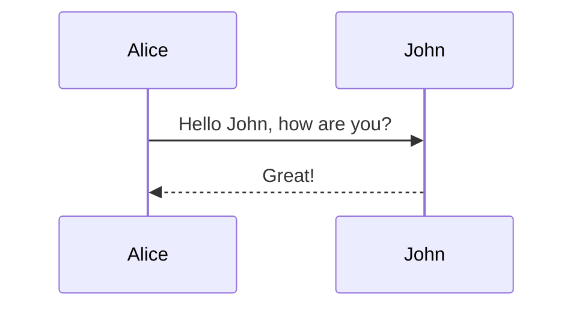

# Userstory-001

Below is just a simple written function, with a nice "framing" to it.
It doesn't do much, but it looks great.

```js
function Kristofer () {
   return Kristofer;
}
```
# Userstory-002 


Just add "```js" and close with "```"

# Userstory-002 


Below is a simple function in java 
```
public class Main {
public static void main(String[] args)
System.out.println("Hello World")
}
```


## Userstory 003

## How to insert an image in markdown
#Quick tutorial

This is a quick guide on how to make it work. No fuzz, just how to put memes inside an .md file such as this one:


You can use standard HTML. Inline styling for CSS properties is allowed.


#View example below:

```HTML
" alt="<IMAGE-DESC>" style="<YOUR-STYLE>" />
```


## USERSTORY 005

## Brackets runt kommentar och parantes runt länk


[Bra musik!](https://www.youtube.com/watch?v=dQw4w9WgXcQ)

## Userstory 006

Sträck för att göra table -- för kolumn


| J | O | N | T | E |
|---|---|---|---|---|
| M | A | R | K | U |
| E | L | I | A | Z |
|   |   |   |   |   |

# Userstory 007
## To use Bold in markdown you put 2 asterisk between the words or word you want bold
This is **Bold text**

## To use Italic tect in markdown you put 1 asterik between the words or word
This is *Italic text*

## Userstory 008


** Hur man lägger in en emoticon i markdown **  

1. Hitta en emoticon du gillar i detta fall använder jag mig av sunglasses

2. Lägg kolon framför och efter emoticon så det blir såhär

:dinEmoticon:

:sunglasses:

## Userstory 009

Horisontal rulers can be created by using three or more of  *,- or _ 
and by placing them all on their own lines.

You should get something like this


***


---


___


# Userstory-010

## Making lists

There are a few ways of making lists.

### 1. 

You can also press ctrl+p to do a block selection, and through "veteran speed keyboarding" make lists incredibly fast.

### 2. 

Of course you can still work the same good old ```<ul/><li/>```-way

#Userstory-013

# Userstory-015

## Highlighting certain words in markdown.

### 1. 

You can either put a mark-tag (w opening/closing tag)


### 2.

You can do it javascript style as well, by highlighting the text by color.

```js
<div style="background-color: #FFFF00">Highlighted text</div>
```
## Userstory 11 
The top compartment contains the name of the class. It is printed in bold and centered, and the first letter is capitalized. It may also contain optional annotation text describing the nature of the class. 
The middle compartment contains the attributes of the class. They are left-aligned and the first letter is lowercase.
The bottom compartment contains the operations the class can execute. They are also left-aligned and the first letter is lowercase.


## Userstory 11 
#Blockquotes

It's just like the funny 4chan texts with the  arrows.

# Check this one out:
```
Just like DaVinci one said:

> Don't fuck with my commits shorty damn

before he got stabbed to death.
```

Which comes out looking like this;

Just like DaVinci one said:

> Don't fuck with my commits shorty damn

before he got stabbed to death.


## Userstory 012

You define a Entity Relationship Diagram by rendering them with mermaid, you start by typing three ` then typing mermaid connected to them, which you also  
end the diagram with but you dont type the mermaid, only three `

Then you make the diagram by defining which type of diagram it is, in this case its an erDiagram.
Here is where you type the different entities and their relationships.
for instance if you write
ENTITY ||--o {SECOND-ENTITY : LABEL  
then you get this



Then you can make them more like a diagram by adding more such as this




# Userstory 016
## How to make a sequence diagram in markdown
You have to first define that you are going to use mermaid, you do this by typing three apostrophes and then the word mermaid after you type three apostrophes to close when you want to stop using mermaid
You then have to specify which diagram you want to use, in this case we want to use a sequence diagram. 

You have to then define which participants you want to use, in this case we will use John and Alice
To The make them connect to eachother you type: 
Alice --> John or John --> Alice

This will result in this:


You then have to specify what you want them to say, you do that by using a colon
For example: John --> Alice: "Hello

This will result in this:


